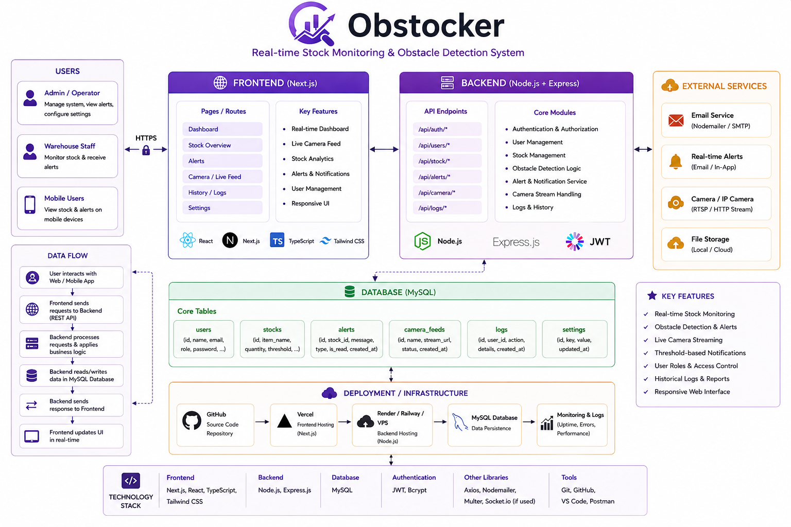
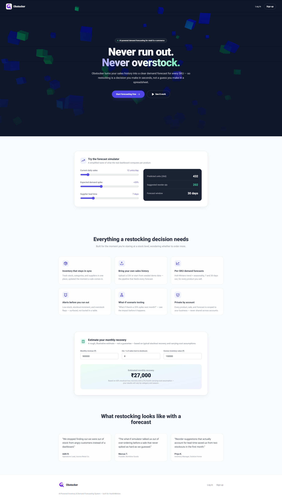
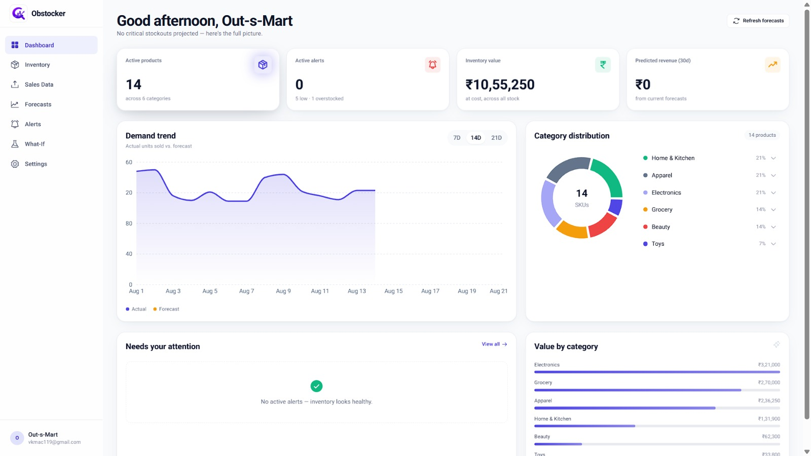
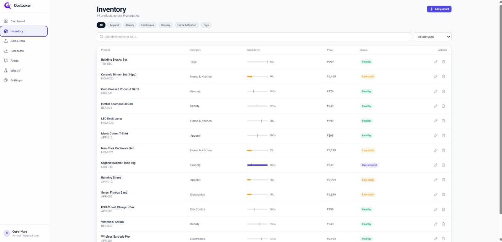
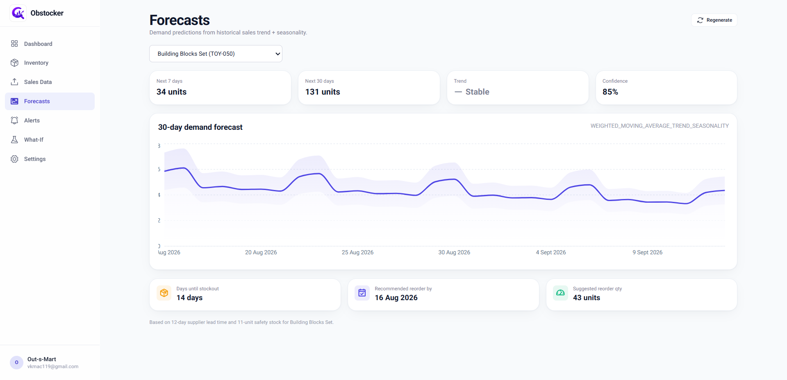
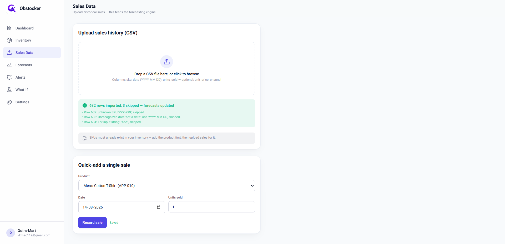
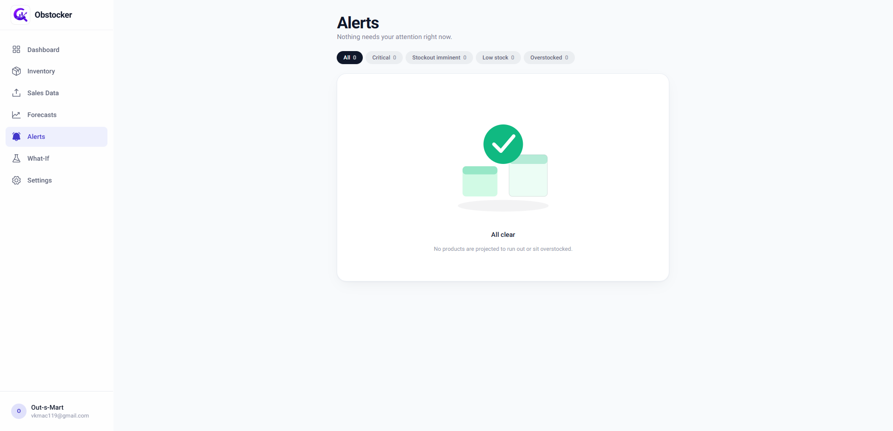
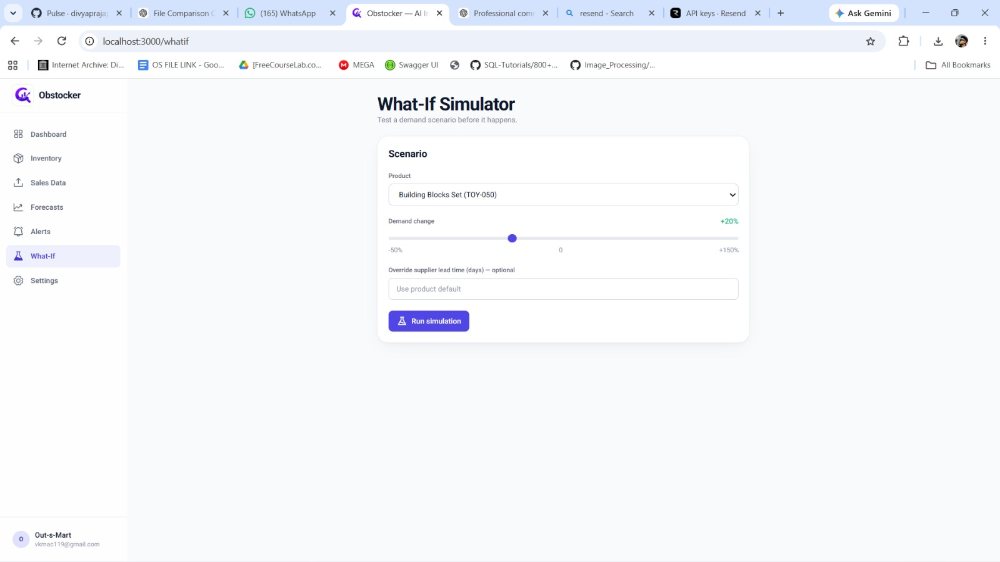
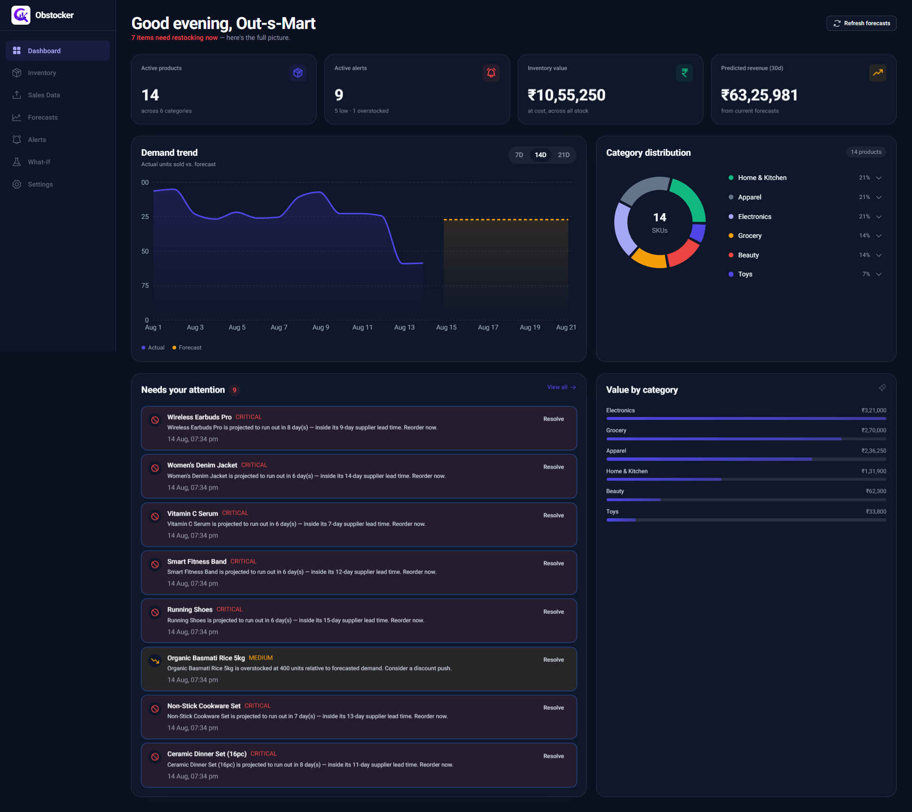

<div align="center">


# Obstocker

### AI-Powered Inventory & Demand Forecasting System

*Because empty shelves lose sales, and overstocked shelves lose money.*

</div>

---

## Team

| Field | Details |
|---|---|
| **Team name** | Obstocker |
| **Team code** | RICR-HIM-1273 |
| **Members** | Divya Prajapati, Abdul Arham Jamal, Vivek Chauhan, Mayank Singh Bhati |
| **Selected theme** | E-Commerce & Retail |

---

## Problem Statement

Every retailer and e-commerce business faces the same question: **how much stock should we keep?**

Order too little, and products run out — customers get frustrated and sales are lost. Order too much, and money sits frozen in unsold inventory while storage costs climb and perishable or seasonal items get written off.

Most small and mid-sized retailers still make these calls on guesswork or basic spreadsheets rather than data-driven prediction. Large companies use advanced demand-forecasting systems, but those are expensive and out of reach for smaller businesses. Meanwhile customer buying patterns shift constantly — seasons, festivals, trends, discounts, even weather.

**The challenge:** build a web platform that lets a retail/e-commerce business manage its product inventory and get intelligent, data-driven predictions of future demand, so restocking becomes a decision made in seconds rather than a guess made in a spreadsheet.

---

## Solution Overview

Obstocker is a full-stack platform that turns raw sales history into actionable restocking decisions.

**Core flow**

1. **Sign up** → a demo catalog (14 products, 6 categories) and ~180 days of realistic sales history are seeded automatically, so the dashboard is never empty on first login.
2. **Manage inventory** → add, edit and track SKUs with category, supplier, lead time, cost, price, stock level and reorder point.
3. **Feed it data** → upload historical sales via CSV (or quick-add single sales). Malformed rows are skipped with per-row warnings rather than failing the whole file.
4. **Get forecasts** → a Python service runs Holt-Winters exponential smoothing (trend + weekly seasonality) per SKU, producing 7- and 30-day demand predictions with confidence bands, projected stockout dates and reorder recommendations.
5. **Act on alerts** → products predicted to run out inside their supplier lead time are flagged critical; overstocked items are flagged for discounting.
6. **Understand *why*** → an analytics engine derives ABC/Pareto revenue classification, demand-volatility segmentation, statistical anomaly detection and service-level safety-stock optimization, then ranks the findings in plain language.
7. **Test scenarios** → the what-if simulator re-runs any forecast under an adjusted demand assumption ("what if there's a 20% spike next month?") without touching stored data.

**What makes it more than a dashboard of static charts**

- **Genuinely data-driven, never random.** Every number traces back to a real calculation on the user's own sales data.
- **Graceful degradation.** If the Python ML service is unreachable, the Spring Boot backend transparently falls back to an equivalent Java-native statistical model, so forecasting never hard-fails.
- **Honest uncertainty.** Demand-volatility segmentation tells you *which* forecasts to trust — an erratic SKU's prediction is presented as inherently less reliable rather than as equally confident.

---

## Technology Stack

| Layer | Technology |
|---|---|
| **Frontend** | Next.js 15 (App Router), React 19, TypeScript, Tailwind CSS |
| **UI / Motion** | Framer Motion, GSAP (+ ScrollTrigger), Radix UI (Popover, Tooltip), Phosphor Icons, `next-themes` |
| **Data viz** | Recharts |
| **3D** | Three.js via `@react-three/fiber` (landing hero) |
| **State / HTTP** | Zustand (persisted), Axios |
| **Backend** | Java 21, Spring Boot 3.3, Spring Security (JWT), Spring Data JPA, springdoc-openapi (Swagger) |
| **Forecasting / ML** | Python 3.12, FastAPI, statsmodels (Holt-Winters), pandas, NumPy |
| **Database** | MySQL 8 |
| **Email** | Resend (REST API) |

### Why four services instead of one?

The forecasting and analytics engines are a separate Python microservice rather than bolted into the Java backend because:

1. The data-science code lives in the language best suited to it (statsmodels, pandas) while the backend stays a clean, typed REST API.
2. It can be swapped for a heavier model — Prophet, an LSTM, a hosted AI API — without touching a single Java file. Only the HTTP contract matters.
3. It forces an explicit failure story: the backend already has a Java fallback for forecasting, so an ML outage degrades quality rather than breaking the product.

---

## Forecasting & Analytics Methodology

### Demand forecasting (`ml-service/forecasting.py`)

1. Build a dense daily time series from sales history, filling gap days with zero.
2. With ≥14 days of history, fit **Holt-Winters triple exponential smoothing** with an additive damped trend and additive weekly (period-7) seasonality. This captures both a product's growth/decline and within-week patterns (e.g. weekend spikes) from as little as two weeks of data.
3. If history is too sparse or the model fails to converge, fall back to a **weighted moving average** (recent days weighted higher) + least-squares linear trend + day-of-week seasonality index.
4. With ≥90 days of history, apply a broad **festival/season multiplier** (Oct–Nov festive, June mid-year sale, January slowdown).
5. Walk the forecast forward day-by-day against current stock to find the **projected stockout date**, then derive a recommended reorder quantity and reorder-by date from supplier lead time and safety stock.

The same weighted-moving-average logic is duplicated in Java (`LocalForecastEngine.java`) so the fallback never disagrees wildly with the primary model.

### Analytics engine (`ml-service/analytics.py`)

| Technique | What it answers |
|---|---|
| **ABC / Pareto classification** | Which SKUs drive ~80% of revenue and deserve the most attention |
| **Demand volatility (coefficient of variation)** | Which forecasts are trustworthy vs. inherently uncertain |
| **Anomaly detection (robust z-score via MAD)** | Which sales days were genuinely unusual — median/MAD rather than mean/stddev, because one huge spike inflates the standard deviation enough to hide itself |
| **Safety stock & reorder point** | `safety_stock = z × σ_demand × √lead_time`, with `z` derived from a tunable target service level (90 / 95 / 99%) |

---

## Installation Guide

### Prerequisites

- Docker & Docker Compose *(recommended path)*, **or**
- Node.js 20+, Java 21, Maven, Python 3.12, MySQL 8

### Option A — Docker Compose (recommended)

```bash
git clone <your-repo-url>
cd obstocker
docker compose up --build
```

Once healthy:

| Service | URL |
|---|---|
| Frontend | https://obstocker.netlify.app |
| Backend |

**Backend API:** https://hackinmotion-ricr-him-1273-production-9645.up.railway.app

**Health Check:** https://hackinmotion-ricr-him-1273-production-9645.up.railway.app/actuator/health |

### Option B — Run each service manually

**1. Database**
```bash
mysql -u root -p < database/schema.sql
```

**2. ML service**
```bash
cd ml-service
pip install -r requirements.txt
uvicorn main:app --reload --port 8000
```

**3. Backend**
```bash
cd backend
export DB_USERNAME=root DB_PASSWORD=yourpassword ML_SERVICE_URL=http://localhost:8000
mvn spring-boot:run
```

**4. Frontend**
```bash
cd frontend
cp .env.local.example .env.local
npm install
npm run dev
```

Then open http://localhost:3000 and sign up with any business name and email — demo data is seeded automatically.

> **Testing the CSV pipeline:** a ready-made [`sample-data/sample-sales-upload.csv`](./sample-data/sample-sales-upload.csv) (635 rows across the seeded SKUs, including deliberately malformed rows to exercise error handling) can be uploaded from the **Sales Data** page immediately after signup.

---

## Environment Variables

### Backend (`backend/src/main/resources/application.yml`)

| Variable | Default | Description |
|---|---|---|
| `DB_HOST` | `localhost` | MySQL host |
| `DB_PORT` | `3306` | MySQL port |
| `DB_USERNAME` | `root` | MySQL user |
| `DB_PASSWORD` | `root` | MySQL password |
| `JWT_SECRET` | *(dev placeholder)* | **Change in production.** HMAC signing key for JWTs |
| `JWT_EXPIRATION_MS` | `86400000` | Token lifetime (24h) |
| `CORS_ORIGINS` | `http://localhost:3000` | Comma-separated allowed origins |
| `ML_SERVICE_URL` | `http://localhost:8000` | Python forecasting/analytics service |
| `RESEND_API_KEY` | *(empty)* | Resend API key. **If unset, no email is sent** — the verification link is written to the application log instead, so signup still works offline |
| `MAIL_FROM` | `Obstocker <onboarding@resend.dev>` | Sender address |
| `APP_BASE_URL` | `http://localhost:3000` | Used to build verification links |
| `GOOGLE_CLIENT_ID` | *(empty)* | Google OAuth2 client ID — **scaffolded, not yet active** |
| `GOOGLE_CLIENT_SECRET` | *(empty)* | Google OAuth2 client secret — **scaffolded, not yet active** |

### Frontend (`frontend/.env.local`)

| Variable | Default | Description |
|---|---|---|
| `NEXT_PUBLIC_API_BASE_URL` | `http://localhost:8080` | Spring Boot API base URL |

---

## API Documentation

Interactive Swagger UI: **`http://localhost:8080/swagger-ui.html`** · Raw spec: `/v3/api-docs`
Full reference with request/response examples: [`api-documentation.md`](./api-documentation.md)

All endpoints except `/api/auth/**` require a bearer token:

```
Authorization: Bearer <token>
```

Every query is scoped server-side to the authenticated user's id — one account can never read another's data.

### Authentication — `/api/auth`

| Method | Path | Description |
|---|---|---|
| `POST` | `/signup` | Create a business account (seeds demo data, issues a verification token) |
| `POST` | `/login` | Authenticate, returns a JWT |
| `GET` | `/verify?token=` | Activate an account from an emailed link |
| `POST` | `/resend-verification?email=` | Re-issue and re-send a verification email |

### Inventory — `/api/products`

| Method | Path | Description |
|---|---|---|
| `GET` | `/` | List active products |
| `GET` | `/{id}` | Get one product |
| `POST` | `/` | Create a product |
| `PUT` | `/{id}` | Update a product |
| `DELETE` | `/{id}` | Deactivate a product |
| `PATCH` | `/{id}/stock?delta=` | Adjust stock by a delta |

### Sales Data — `/api/sales`

| Method | Path | Description |
|---|---|---|
| `POST` | `/upload` | Upload sales CSV (`multipart/form-data`). Columns: `sku, date, units_sold`, optional `unit_price, channel` |
| `POST` | `/manual` | Record a single sale |

### Forecasting — `/api/forecasts`

| Method | Path | Description |
|---|---|---|
| `GET` | `/{productId}` | Latest forecast (auto-generates on first call) |
| `POST` | `/{productId}/generate` | Force-regenerate one product's forecast |
| `POST` | `/generate-all` | Regenerate all forecasts (runs concurrently) |

### Alerts — `/api/alerts`

| Method | Path | Description |
|---|---|---|
| `GET` | `/` | List unresolved alerts |
| `PATCH` | `/{id}/resolve` | Mark an alert resolved |

### Analytics & Reports — `/api/insights`

| Method | Path | Description |
|---|---|---|
| `GET` | `/report?serviceLevel=0.95` | ABC classification, volatility segmentation, anomalies, safety-stock recommendations and ranked findings |

### Other

| Method | Path | Description |
|---|---|---|
| `GET` | `/api/dashboard/summary` | Aggregated dashboard payload (KPIs, category mix, demand trend, recent alerts) |
| `POST` | `/api/what-if/simulate` | Run a demand-change scenario |
| `POST` | `/api/purchase-orders` | Simulate sending a supplier purchase order |
| `GET` | `/api/purchase-orders` | List simulated purchase orders |

### Error shape

Every error returns the same JSON via a global handler, so the frontend has a single error path:

```json
{
  "timestamp": "2026-08-13T10:15:00",
  "status": 400,
  "error": "Bad Request",
  "message": "CSV must include at least these columns: sku, date, units_sold.",
  "details": []
}
```

---

## Database Details

**Engine:** MySQL 8 (InnoDB, `utf8mb4`) · **Schema:** [`database/schema.sql`](./database/schema.sql)

| Table | Purpose |
|---|---|
| `users` | Business accounts, credentials, email-verification state |
| `warehouses` | Multi-location support (schema-ready) |
| `products` | Inventory catalog — SKU, category, supplier, lead time, cost/price, stock, reorder point |
| `sales_records` | Historical sales (CSV-uploaded, seeded or manual) — the forecasting data pipeline |
| `forecasts` | Stored forecast snapshots per product, incl. daily prediction JSON |
| `alerts` | Low-stock / overstock / stockout-imminent flags |
| `what_if_simulations` | Saved scenario runs |
| `purchase_orders` | Simulated supplier orders |

**Data isolation:** every domain table carries a `user_id` foreign key with `ON DELETE CASCADE`, and all queries are scoped to the authenticated user.

**Key indexes**

| Index | Table | Rationale |
|---|---|---|
| `uq_user_sku` | `products` | Enforces SKU uniqueness per account |
| `idx_product_user_category` | `products` | Category filtering / distribution |
| `idx_sales_product_date` | `sales_records` | Per-product history for forecasting |
| `idx_sales_user_date` | `sales_records` | Bulk account-wide range queries (dashboard, analytics) |
| `idx_forecast_product_time` | `forecasts` | Latest-forecast lookups |
| `idx_alert_user_resolved` | `alerts` | Active-alert feed |
| `idx_users_verification_token` | `users` | Email verification lookups |

---

## Architecture Diagram

|  |

**Forecast flow:** sales history → Spring Boot → Python Holt-Winters forecast (Java fallback if unreachable) → forecasts and alerts persisted to MySQL → analytics engine derives ABC class, volatility, anomalies and safety-stock recommendations → dashboard and reports.

---

## Screenshots

_[to be added]_

| View | Screenshot |
|---|---|
| Landing page |  |
| Dashboard |  |
| Inventory |  |
| Forecasts |  |
| Analytics & Reports |  |
| Alerts |  |
| What-If Simulator |  |
| Dark mode |  |

---

## Future Scope

**Near term**

- **Google OAuth 2.0** — Spring Security config and env vars are scaffolded; needs a Google Cloud client ID/secret and a callback handler to activate.
- **Email verification go-live** — the full flow (token generation, verify endpoint, branded HTML email, resend, frontend banner) is built and compiling; it needs a real `RESEND_API_KEY` to actually deliver mail.
- **Password reset** — same token infrastructure as email verification, not yet wired.
- **Real supplier integrations** — replace the simulated purchase-order flow with live EDI / supplier APIs.

**Model & analytics**

- **Richer forecasting models** — Prophet or a gradient-boosted / LSTM approach benchmarked against the current Holt-Winters baseline, selected per SKU by backtest accuracy.
- **Learned seasonality** — replace the broad month-level festival multiplier with effects learned per category from a full year of data.
- **Price optimization** — turn overstock signals into concrete discount recommendations based on forecasted sell-through and margin.
- **Forecast accuracy tracking** — store predictions against realised sales to report MAPE/MAE over time, making model quality visible rather than assumed.
- **LLM narrative reports** — layer natural-language summaries over the existing quantitative findings (current insights are template-composed from computed values, which keeps every quoted figure accurate and reproducible).

**Platform**

- **Multi-location inventory** — extend the warehouse-scoped schema already in place to stock transfers between stores.
- **Role-based access** — owner / manager / viewer permissions per account.
- **Scheduled reporting** — automated weekly email digests of alerts and analytics.

---

<div align="center">

Built for **HackInMotion** · Theme: E-Commerce & Retail

</div>
